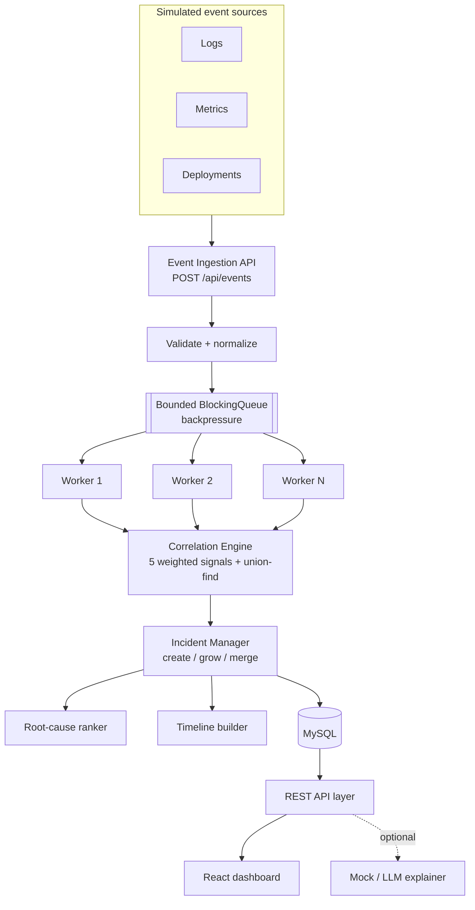
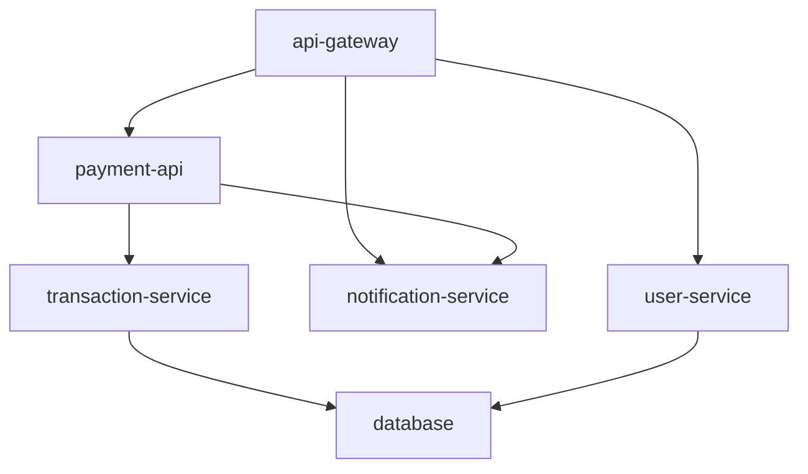
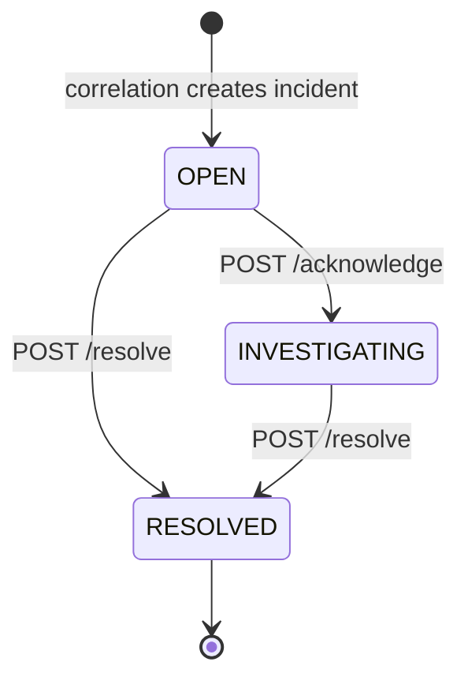
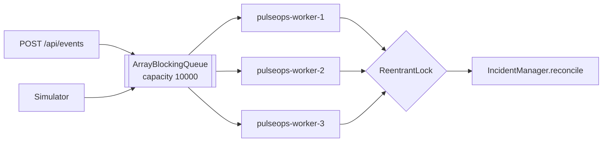
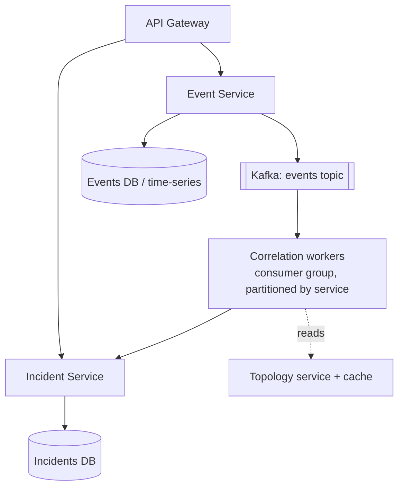

# PulseOps — Intelligent Cloud Incident Correlation Platform

PulseOps ingests simulated cloud infrastructure events (logs, metrics, alerts,
deployments), **correlates related events with a deterministic scoring engine**,
groups them into incidents, ranks probable root causes, builds a timeline, and
shows everything on a React dashboard. An optional AI layer turns the
deterministic result into prose — it never decides the grouping.

> A personal project exploring event correlation, incident detection and
> explainable scoring — built to work through the engineering of the problem
> end to end (ingestion, concurrency, a real algorithm, a dashboard) rather
> than as a toy CRUD app.

---


## 1. Problem statement

When a cloud system breaks, engineers face a flood of signals from many services
and have to answer two questions by hand:

1. **Which of these events are the same incident?**
2. **What is the most likely root cause?**

This correlation work is slow, needs tribal knowledge of service dependencies,
and does not scale with the number of services. PulseOps automates it.

## 2. Why this problem matters

- **MTTR is dominated by triage, not fixing.** Getting to "these 40 alerts are
  one incident caused by the database" quickly is most of the value.
- **Alert fatigue is real.** Grouping 40 alerts into 1 incident with a ranked
  cause is the difference between an actionable page and noise.
- **It is a genuine distributed-systems problem** — temporal reasoning, a
  dependency graph, concurrent ingestion, explainability — not a wrapper around
  an API.

## 3. What it is NOT

It is **not** "upload logs → ask an LLM what happened". The correlation engine is
deterministic, explainable and unit-tested. The LLM (a mock by default) is an
optional presentation layer behind an interface.

---

## 4. Architecture



**One deployable Spring Boot app**, organised into modules with clean seams
(`events`, `ingest`, `correlation`, `incident`, `topology`, `simulator`,
`explain`, `dashboard`, `benchmark`). The correlation engine has **no Spring-web
or JPA dependency** — it is pure domain logic.

### Why NOT Kafka / Redis / Elasticsearch / Kubernetes / Prometheus in v1

Every dependency has to earn its place. At this scale an in-process
`ArrayBlockingQueue` demonstrates the same concurrency concepts (backpressure,
batching, worker pools) that Kafka would, without operational overhead. See
[§18 Future production architecture](#18-future-production-architecture) for how
each of those slots in when the load justifies it.

---

## 5. Technology stack

| Layer | Choice | Why |
|---|---|---|
| Language | Java 17 | records, sealed switch, pattern matching |
| Framework | Spring Boot 3.3 | REST + DI + JPA + test slices + actuator in one stack |
| Persistence | Spring Data JPA + MySQL 8 | relational: `events`↔`incidents` joins, M:N link table |
| Migrations | Hibernate `ddl-auto` (v1) | zero-setup; prod path is Flyway + `validate` |
| API docs | springdoc-openapi | interactive Swagger UI at `/swagger-ui.html` |
| Frontend | React 18 + Vite + React Router | SPA with a handful of routes |
| Charts | Recharts | small, declarative; D3 is too low-level here |
| Container | Docker + Docker Compose | one command brings up MySQL + backend + frontend |
| Tests | JUnit 5, Mockito, Spring Boot Test, Awaitility | unit + slice + full-context integration |

---

## 6. Event model

```json
{
  "eventId": "EVT-92831",
  "timestamp": "2026-09-01T14:32:11Z",
  "service": "payment-api",
  "host": "node-03",
  "eventType": "HTTP_500",
  "severity": "HIGH",
  "metric": "error_rate",
  "value": 18.4,
  "message": "HTTP 500 rate exceeded threshold"
}
```

**Event types:** `HTTP_500`, `HTTP_503`, `HIGH_LATENCY`, `CPU_SPIKE`,
`MEMORY_SPIKE`, `DB_CONNECTION_EXHAUSTION`, `NETWORK_ERROR`, `DEPLOYMENT`,
`SERVICE_RESTART`, `PAYMENT_FAILURE`, `QUEUE_BACKLOG`.

**Severities:** `LOW` < `MEDIUM` < `HIGH` < `CRITICAL` (ordinal order is
meaningful — used for `max()` and the severity sub-score).

### Service topology (seeded)



`A --> B` means "A depends on B". The correlation engine uses the **shortest
undirected hop distance** between two services as a signal.

---

## 7. Correlation algorithm

For every **pair** of events in a sliding time window, PulseOps computes five
normalised sub-scores in `[0,1]` and combines them with configurable weights
(normalised to sum to 1, so the result stays in `[0,1]`):

| Signal | What it measures | Default weight |
|---|---|---|
| `temporal` | closeness in time — exponential decay, `0.5` at the half-life (120 s) | 0.30 |
| `service-dependency` | `0.6^hops` in the dependency graph (`1.0` same service) | 0.25 |
| `event-type` | curated affinity table (`DB_CONNECTION_EXHAUSTION`+`HTTP_500` = 0.9) | 0.20 |
| `deployment` | same deployment id, or an anomaly shortly after a `DEPLOYMENT` | 0.15 |
| `severity` | summed severity weight ÷ 8 (both `CRITICAL` → 1.0) | 0.10 |

```
score(a,b) = Σ  weightᵢ · subScoreᵢ(a,b)
```

Pairs with `score ≥ threshold` (default `0.55`) are **linked**. Linked pairs feed
a **union-find** structure; each connected component of ≥ 2 events becomes one
incident. This means A–B and B–C linked ⇒ A, B, C are one incident even if A–C
never scored above threshold.

Weights, threshold, window and half-life are all in `application.yml` under
`pulseops.correlation.*` — **no magic numbers in code**.

### Explainability

Every incident stores a human summary built from the sub-scores that actually
fired, e.g.:

> *"6 events across database, payment-api, transaction-service within 38s;
> strongest signals: temporal proximity and service dependency (grouping
> strength 0.68)."*

The structured breakdown (per-signal average contribution + sample details) is
available at `GET /api/incidents/{id}` under `correlation.topSignals`.

### Complexity

All-pairs comparison is **O(n²)** in the window size. That is fine for realistic
windows (minutes of events). For larger scales you bucket events by
service/time and only compare within and across adjacent buckets — discussed in
§18.

---

## 8. Root-cause scoring

After grouping, rules score six candidate causes: `DEPLOYMENT`,
`DATABASE_FAILURE`, `RESOURCE_EXHAUSTION`, `NETWORK_PROBLEM`, `SERVICE_FAILURE`,
`DEPENDENCY_FAILURE`. Each rule adds to a candidate's raw score and records an
evidence string. The raw score is squashed to `[0,1)` with a diminishing-returns
curve (`1 − 0.5^(raw/0.6)`).

> **These are heuristic "root-cause scores", not statistical probabilities.**
> They rank hypotheses. The API response for `/root-cause` carries this
> disclaimer explicitly.

Example (`database-failure` scenario, real output):

| Candidate | Score | Evidence |
|---|---|---|
| Database failure | 0.72 | DB_CONNECTION_EXHAUSTION observed; database emitted events; downstream 5xx |
| Upstream dependency failure | 0.60 | events span 3 services along a dependency path; earliest activity on `database` |
| Resource exhaustion | 0.21 | elevated latency is consistent with resource saturation |

---

## 9. Incident lifecycle



Illegal transitions (resolving a `RESOLVED` incident) return **409**. A
`RESOLVED` incident is terminal; new correlated activity opens a fresh incident.

When a new event cluster overlaps an existing open incident, the incident
**grows**. When a cluster bridges two open incidents, they **merge** (oldest
survives, links repointed, empty incident deleted).

---

## 10. Concurrency model



- **Bounded `ArrayBlockingQueue`** — producers hand off and return immediately.
  When full, `submit()` fails fast with **HTTP 429** (`INGEST_QUEUE_FULL`)
  instead of the JVM slowly OOMing. That is backpressure made visible. An
  unbounded queue would just hide the overload.
- **Fixed `ThreadPoolExecutor`** (`Executors.newFixedThreadPool`, named threads,
  daemon) — correlation is CPU-bound, so more threads than cores only adds
  context switching. Worker count is configurable (`pulseops.ingest.worker-count`)
  and the benchmark sweeps it.
- **Batch drain** — each worker takes up to `batch-size` events per cycle;
  correlation runs once per batch, not per event.
- **Single-writer for incident state** — many workers persist events
  concurrently, but incident reconciliation (read graph → mutate → write) is
  serialised through one `ReentrantLock`. Simple and correct; §18 shows the
  partitioned/actor evolution.
- **Race conditions avoided** — shared counters are `AtomicLong`/`AtomicInteger`
  (monotonic, no compound invariant); the queue is thread-safe by contract;
  incident mutation is single-threaded by the lock; the event write path commits
  before the enqueue so a worker never sees a missing row.
- **Failure isolation** — an exception in one batch is logged + counted; the
  worker loops to the next batch.
- **Safety net** — a `@Scheduled` sweep re-runs reconciliation over the recent
  window every 15 s, so even an event rejected by backpressure (429) is
  eventually correlated once the queue drains.
- **Graceful shutdown** — `@PreDestroy` stops the pool and waits up to 10 s for
  in-flight batches.

**When event volume increases:** the queue fills → latency to correlation rises
→ at capacity, producers get 429 and back off → the sweep still guarantees
eventual correlation. Throughput scales with worker count up to core count (see
§17).

---

## 11. Database schema

Tables: `services`, `service_dependencies`, `deployments`, `events`,
`incidents`, `incident_events`. Full reference DDL with keys and indexes:
[`docs/schema.sql`](docs/schema.sql).

Highlights:
- **Primary keys** — surrogate `BIGINT AUTO_INCREMENT` everywhere except
  `services` (natural key: the service name, which every event carries).
- **Foreign keys** — `service_dependencies → services` (both ends),
  `incident_events → incidents` and `→ events`.
- **`incident_events`** is the **many-to-many** join, modelled as an entity
  because the link carries `correlation_score`. `UNIQUE(incident_id, event_id)`
  makes attaching idempotent.
- **One-to-many** — one incident has many `incident_events`; one deployment has
  many events.
- **Indexes** — `events(occurred_at)` backs both the correlation window scan and
  time-range filters; `events(service)` and `events(event_type)` back the
  `GET /api/events` filters; `incidents(status)` backs the "open incidents" query.
- **DTOs, not entities** — every controller returns a DTO/record; entities never
  cross the HTTP boundary.

---

## 12. REST API

Interactive docs (running app): **`http://localhost:8080/swagger-ui.html`**

| Method & path | Purpose |
|---|---|
| `POST /api/events` | ingest one event → **202** `{eventId, status, queueDepth}` |
| `GET /api/events` | list, filters: `service, severity, eventType, from, to, page, size` |
| `GET /api/events/{id}` | one event (`EVT-12` or `12`) |
| `GET /api/incidents` | list, filters: `status, severity, page, size` |
| `GET /api/incidents/{id}` | full detail: correlation, root causes, timeline, events |
| `POST /api/incidents/{id}/acknowledge` | `OPEN → INVESTIGATING` |
| `POST /api/incidents/{id}/resolve` | `→ RESOLVED` (409 if already resolved) |
| `GET /api/incidents/{id}/events` | correlated events |
| `GET /api/incidents/{id}/timeline` | chronological timeline |
| `GET /api/incidents/{id}/root-cause` | ranked candidates + disclaimer |
| `POST /api/incidents/{id}/explain` | validated structured explanation (mock LLM) |
| `GET /api/services` | topology graph (nodes + edges) |
| `GET /api/services/{name}` / `/dependencies` | one service + neighbours |
| `GET /api/simulator/scenarios` | list scenarios |
| `POST /api/simulator/scenarios/{slug}` | inject a scenario |
| `POST /api/benchmark?count=&workers=&windowSize=` | measure correlation throughput |
| `GET /api/dashboard/overview` | everything the landing page needs |
| `GET /actuator/health` | liveness/readiness |

### Error shape (centralised, no stack traces)

```json
{
  "timestamp": "2026-09-01T14:32:11Z",
  "status": 400,
  "error": "VALIDATION_FAILED",
  "message": "Event failed validation",
  "details": ["unknown service 'nope'", "unknown eventType 'HTTP_999'"]
}
```

Codes: `VALIDATION_FAILED` (400), `MALFORMED_REQUEST` (400),
`EVENT_NOT_FOUND` / `INCIDENT_NOT_FOUND` / `SERVICE_NOT_FOUND` (404),
`INVALID_TRANSITION` (409), `INGEST_QUEUE_FULL` (429), `INTERNAL_ERROR` (500).

---

## 13. React dashboard

| Page | Shows |
|---|---|
| **Dashboard** | active/critical incident counts, events/min, services affected, event-volume area chart, open-incident severity bars, recent incidents, live ingest-pipeline stats |
| **Incidents** | filterable table (status, severity) with confidence bars |
| **Incident Details** | severity/status/confidence, affected services, **why these events were grouped** + per-signal table, ranked root causes with evidence, timeline, correlated events, "Generate AI explanation" |
| **Event Explorer** | all events, filter by service / type / severity |
| **Service Map** | SVG dependency graph, services in an active incident outlined in red, per-service detail cards |
| **Simulator** | one button per scenario + a correlation benchmark panel (events / workers / window) |

Component layout: `components/`, `pages/`, `charts/`, `hooks/` (`usePolling`),
`services/api.js` (single axios client), `utils/`. Pages poll every 4–5 s so the
UI tracks the pipeline without a websocket.

---

## 14. Simulator

Four failure scenarios + background noise, each a hand-authored script of events
back-dated so the whole scenario sits inside the correlation window. Events go
through the **real** `POST /api/events` path (validated, persisted, queued,
correlated).

| Scenario | Script → expected outcome |
|---|---|
| `database-failure` | `DB_CONNECTION_EXHAUSTION` → `HIGH_LATENCY` → `HTTP_500` → `PAYMENT_FAILURE` across the dependency chain ⇒ one incident, root cause **Database failure** |
| `bad-deployment` | `DEPLOYMENT` → `HIGH_LATENCY` → `HTTP_500` → `SERVICE_RESTART` ⇒ one incident, root cause **Deployment** |
| `cpu-saturation` | `CPU_SPIKE` → `HIGH_LATENCY` → `HTTP_503` ⇒ root cause **Resource exhaustion (CPU)** |
| `network-failure` | `NETWORK_ERROR` → `HTTP_503` → `SERVICE_RESTART` ⇒ root cause **Network problem** |
| `normal-traffic` | 12 low-severity events spread over ~2 min ⇒ **no incident** (proves the engine doesn't cry wolf) |

---

## 15. AI explanation layer

`POST /api/incidents/{id}/explain` builds a **structured context** (title,
severity, affected services, correlation summary, ranked root causes, timeline)
and passes it to an `IncidentExplainer`. The response conforms to a fixed schema:

```json
{
  "summary": "Incident INC-1 (CRITICAL) affects database, payment-api… most likely cause is database failure (72%)…",
  "probableCause": "Database failure",
  "evidence": ["DB_CONNECTION_EXHAUSTION observed", "…"],
  "recommendedChecks": ["Check database connection pool utilisation…", "…"],
  "generatedBy": "mock"
}
```

- **Default: `MockIncidentExplainer`** — deterministic, no network, no
  credentials, safe in CI.
- **`ExplanationValidator`** rejects malformed output (empty fields, oversized
  lists) *before* it reaches the client — the guardrail that matters once a real
  LLM is behind the interface.
- Dropping in an `LlmIncidentExplainer` bean (same interface) automatically
  replaces the mock (`@ConditionalOnMissingBean`). The deterministic engine stays
  the source of truth in both cases — **the LLM never changes incident grouping**.

---

## 16. Testing

```bash
cd backend
mvn test        # 25 unit / slice tests
mvn verify      # + 14 full-context integration tests (39 total)
```

| Area | Tests |
|---|---|
| Topology | dependency-distance: same service, direct, transitive, unknown, directionality |
| Correlation engine | groups a temporal dependency chain; does **not** group far-apart or unrelated events; strength ∈ [0,1]; single event → no cluster |
| Scorers | temporal decay: 1.0 at zero gap, 0.5 at half-life, monotonic |
| Severity | base severity, blast-radius escalation, multi-critical escalation, capped at CRITICAL |
| Root cause | database scenario ranks DB first; bad-deployment ranks deployment first; scores are not a probability distribution |
| Explanation validator | accepts well-formed, rejects empty summary / empty evidence |
| REST (`EventControllerIT`) | 202 on valid; 400 + error body on missing field / unknown service / unknown type; 404; 400 on malformed id |
| REST (`IncidentControllerIT`) | list, detail, root-cause disclaimer, acknowledge→resolve→409, 404, explain schema |
| Concurrency (`IngestPipelineConcurrencyTest`) | 8 producers × 40 events → every event persisted exactly once, zero failures, all processed |
| End-to-end (`SimulatorIncidentIT`) | `database-failure` → one incident, right services, right root cause; `normal-traffic` → no incident |

No performance claims are made in tests — throughput is measured separately (§17).

---

## 17. Performance benchmark

`POST /api/benchmark?count=&workers=&windowSize=` generates synthetic events in
memory, partitions them into windows, and runs the correlation engine across a
configurable thread pool. **No database writes** — it isolates the CPU-bound
core. Every call does the work and times it; nothing is cached or fabricated.

Example run — **Docker container on the dev machine (Windows 11, JDK 17),
`windowSize=500`.** Your numbers will differ with core count, JIT warm-up and
window size.

| events | workers | elapsed | throughput |
|---:|---:|---:|---:|
| 1,000 | 4 | 220 ms | ~4,500 evt/s |
| 10,000 | 4 | 1,359 ms | ~7,400 evt/s |
| 20,000 | 4 | 3,177 ms | ~6,300 evt/s |
| 50,000 | 4 | 8,646 ms | ~5,800 evt/s |
| 20,000 | 1 | 6,804 ms | ~2,900 evt/s |
| 50,000 | 1 | 22,654 ms | ~2,200 evt/s |

Observations: 4 workers give ~**2.4–2.6×** the throughput of 1 (sub-linear —
correlation is O(n²) per window and the machine has limited physical cores).
Larger windows lower events/sec because per-window cost grows quadratically.

**Performance depends on** CPU core count and speed, JVM warm-up, the window
size, and — for the full ingest path (not this benchmark) — MySQL configuration
and connection-pool size.

---

## 18. Future production architecture



| Concern | v1 (now) | Production |
|---|---|---|
| Transport | in-process `ArrayBlockingQueue` | **Kafka** — durable, replayable, partitioned by service key; workers become a consumer group and scale horizontally |
| Correlation state | one `ReentrantLock` | partition by service/incident key (Kafka partition or actor per key) → no global lock, ordering preserved per key |
| Events store | MySQL | keep MySQL for incidents; move raw events to a time-series store / **Elasticsearch** for retention + full-text |
| Topology | seeded table + in-memory cache | pull from a service catalogue / CMDB; cache in **Redis** with change events |
| Metrics/health | `/actuator/health` | **Prometheus** scrape + **Grafana**; alerting on queue depth, worker lag, reconcile latency |
| Deploy | Docker Compose | **Kubernetes** — HPA on queue lag, liveness/readiness probes, rolling deploys |

**What should become a microservice, and why:** `Event Service` (write-heavy,
scales with ingest volume) and `Incident Service` (read-heavy, owns the incident
lifecycle) have different scaling and availability profiles, so splitting them
lets each scale independently. Correlation workers are a third unit (CPU-bound,
scale with event rate). **Communication:** ingest is async (Kafka) for
throughput and failure isolation; dashboard reads are sync REST. **Eventual
consistency:** an event is durable in Kafka before it is correlated; the incident
view lags ingest by the worker delay, which is acceptable and made visible on the
dashboard. **Failure isolation:** if correlation workers fall behind, ingest and
the dashboard keep working; the backlog drains when capacity returns.

I am **not** splitting into 12 services now — that would add deployment,
network-failure and distributed-tracing complexity with no benefit at this scale.
The module boundaries are drawn so the split is mechanical when it's justified.

---

## 19. How to run

### Docker (everything)

```bash
cp .env.example .env      # optional; edit credentials
docker compose up --build
```

- Dashboard → **http://localhost:8088**
- API + Swagger → **http://localhost:8080/swagger-ui.html**
- MySQL → `localhost:3307` (mapped off 3306 to avoid clashes)

Then open the dashboard, go to **Simulator**, click **Database Failure**, and
watch an incident appear on the Dashboard and Incidents pages.

### Local development

```bash
# backend (needs a MySQL on :3306, db/user/pass 'pulseops', or edit application.yml)
cd backend && mvn spring-boot:run

# frontend
cd frontend && npm install && npm run dev      # http://localhost:5173, proxies /api
```

### Tests

```bash
cd backend && mvn verify
```

---

## 20. Design tradeoffs

| Decision | Alternative | Why this way |
|---|---|---|
| Modular monolith | microservices | fewer moving parts; boundaries still explicit |
| In-process queue | Kafka | demonstrates the same concepts; no infra to run |
| `ddl-auto: update` | Flyway from day 1 | zero setup for a demo; documented prod path |
| O(n²) all-pairs correlation | bucketed / streaming | simplest correct version; fine for minute-scale windows |
| Single reconciliation lock | fine-grained locking | correctness first; no deadlocks; profiled as cheap |
| Heuristic root-cause rules | ML model | explainable, testable, no training data needed |
| Mock explainer default | require an API key | project runs with zero credentials; LLM is opt-in |
| Poll every 4 s | WebSocket/SSE | simpler; fast enough for a dashboard |

## 21. Limitations

- Correlation is all-pairs O(n²) per window — not tuned for very high event
  rates (see §18 for the fix).
- Root-cause scores are heuristics, not calibrated probabilities.
- The topology is seeded, not discovered.
- No authentication/authorization (see §22).
- Incident merging picks the oldest incident as survivor; it does not attempt to
  split an incident that later looks like two.
- Benchmark measures the correlation core, not the full DB-bound ingest path.

## 22. Security notes

Implemented: centralised input validation (Bean Validation + semantic
`EventValidator`), no secrets in source (DB credentials come from env vars),
safe logging (no payloads/secrets logged), non-root container user, opaque 500s
(no stack traces to clients).

Deliberately **not** built (would be over-engineering for v1, all straightforward
to add): API authentication (JWT/OAuth2 resource server), per-endpoint
authorization, rate limiting (bucket4j or gateway-level), audit log, TLS
termination (handled by the ingress in production).

## 23. Repository layout

```
PulseOps/
├── backend/                 Spring Boot app
│   └── src/main/java/com/pulseops/
│       ├── events/          ingestion, validation, query, EventController
│       ├── ingest/          IngestQueue, EventProcessingPipeline, metrics
│       ├── correlation/     engine, 5 scorers, union-find, explanation  ← core
│       ├── incident/        manager, lifecycle, severity, root cause, timeline
│       ├── topology/        service graph + dependency distance
│       ├── deployments/     deployment records
│       ├── simulator/       scenario scripts
│       ├── explain/         IncidentExplainer interface + mock + validator
│       ├── dashboard/       overview aggregation
│       ├── benchmark/       in-memory throughput benchmark
│       ├── common/          error model, page envelope, id parsing
│       └── config/          Clock, CORS, properties
├── frontend/                React + Vite dashboard
├── docs/                    requirements & architecture notes, schema.sql
├── docker-compose.yml
└── README.md
```
